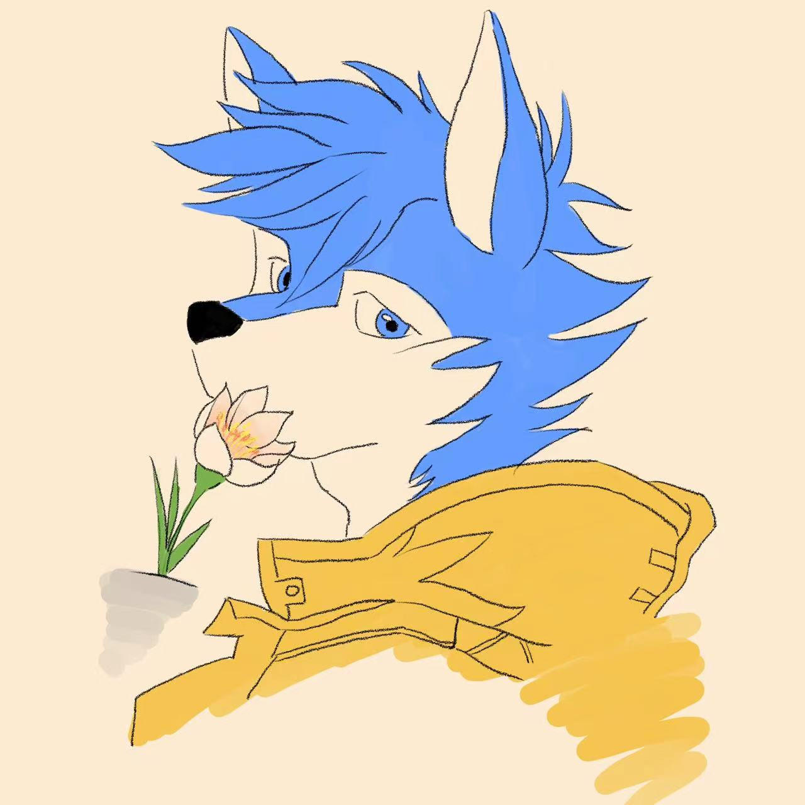

<h1 align="center">Hi 👋, 这里是 Nick wald</h1>
<h3 align="center">🌻 向阳生长，灿若花开 🌻</h3>

  

## 🤔关于我

这里是Nickwald，一个正在努力的Furry。

📖就读于 北京邮电大学

📫联系方式：
- 📧邮箱：nickwald@163.com
- 🐧QQ：870585593
- 📝Blog: [Nickwald的琐碎日常](www.nickwald.top)

💬语言：
- 简体中文
- 繁体中文
- English

## 🌱正在学习

- Godot/GDScript
- C/C++
- Python
- Java
- HTML/Vue3/PHP/MySQL/Nginx
- 微信小程序

## 👨‍💻当前项目

- [Enlightenment启明游戏引擎](https://github.com/Nick-wald/Enlightenment)
- 【计划】雏燕项目

## 🔭更多……

- 🚂Steam：[Nick-wald](https://steamcommunity.com/id/nickwald/)

<!--
**Nick-wald/Nick-wald** is a ✨ _special_ ✨ repository because its `README.md` (this file) appears on your GitHub profile.

Here are some ideas to get you started:

- 🔭 I’m currently working on ...
- 🌱 I’m currently learning ...
- 👯 I’m looking to collaborate on ...
- 🤔 I’m looking for help with ...
- 💬 Ask me about ...
- 📫 How to reach me: ...
- 😄 Pronouns: ...
- ⚡ Fun fact: ...
-->
